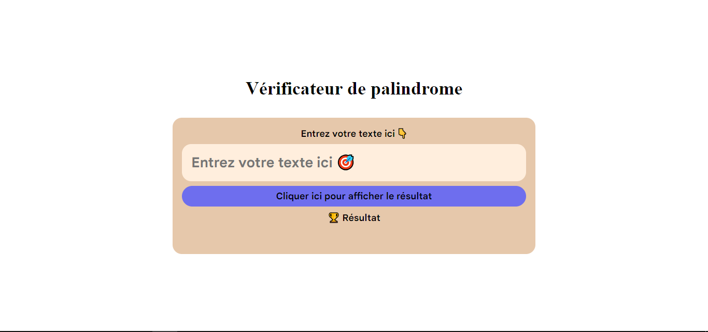

# Examen Atelier IT B1SI
L'examen s'est déroulée le 16/06/2025 à 13:00 GMT

Elle comporte deux exercices

> [!NOTE]
>
> Pour ce projet, j'ai utilisé HTML, CSS et Javascript

## Un vérificateur de palindrome
L'utilisateur doit saisir un mot puis une action lui fera afficher si le mot est un palindrome ou pas

## Une calculatrice simple
L'utilisateur doit saisir deux nombres puis choisir une opération (addition, multiplication, soustraction, division). Le programme devra lui afficher le résultat
